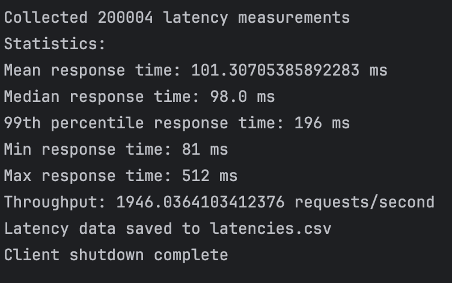

# Ski Resort Client Documentation

GitHub Repo: https://github.com/zz39/SkiResort-CS6650

## Configuration

### Server Configurations

1. Deploy the `Assignment1.war` file to your EC2 instance running Tomcat.
2. Ensure that your EC2 instance is properly configured to allow traffic on port 8080.
3. Start the Tomcat server and verify that the application is running by accessing `http://{server-public-ip}:8080/Assignment1/`.
4. Make sure the API endpoints are accessible and functioning correctly.

### Client Configurations

1. Update API endpoint in `PostingSkiInfo.java`:
```java
private SkiersApi createApiClient() {
    ApiClient apiClient = new ApiClient();
    apiClient.setBasePath("http://{server-public-ip}:8080/Assignment1/");
    return new SkiersApi(apiClient);
}
```

2. Adjust thread (Optional) and request settings in `MultithreadedClient.java`:
```java
// example:
  private static int TOTAL_REQUESTS = 200000;
  private static int ORIGINAL_THREADS = 32;
  private static int REQUESTS_PER_THREAD = 1000;
```

3. run `MultithreadedClient.java`:
```bash
javac MultithreadedClient.java
java MultithreadedClient
```

## Design Documentation

### Client Design Overview
The client implements a multi-threaded architecture to efficiently send POST requests to a ski resort API. It uses a two-phase approach to handle 200,000 POST requests with optimal throughput.


### Key Components

1. **MultithreadedClient (Main)**
   - Manages overall execution flow
   - Handles statistics collection and reporting
   - Coordinates between event generation and request processing

2. **SkierEventGenerator (Producer)**
   - Generates random lift ride events
   - Populates shared blocking queue
   - Ensures thread-safe event distribution

3. **PostingSkiInfo (Consumer)**
   - Processes POST requests to API
   - Implements retry logic
   - Records latency metrics
   - Manages request success/failure tracking

### Thread Safety Considerations
- Uses `BlockingQueue` for safe event distribution
- Atomic counters track successful/failed requests
- CountDownLatch ensures phase synchronization

### Threading Strategy
- Phase 1: 32 threads × 1000 requests = 32,000 requests
- Phase 2: 100 threads × ~1680 requests = 168,000 requests
- ThreadPoolExecutor manages execution

### Performance Analysis

#### 32-100 Thread Approach
- Success Rate: 100%
- Mean Response Time: 98.61 ms
- 99th Percentile: 190 ms
- Throughput: 291.57 requests/second

#### Experiment: 200 Threads × 100 Requests
- Success Rate: 100%
- Mean Response Time: 98.0 ms
- 99th Percentile: 196 ms
- Throughput: 1946.03 requests/second

#### Key Insights
- Increasing threads to 200 significantly boosted throughput (~6.6x improvement).
- Response times remained stable, indicating efficient concurrency handling.
- The setup effectively balances performance and resource utilization.

### Client Outputs
**Client-1 (initial configuration)**


**Client-2 (initial configuration)**


**Client-2 (optimized configuration)**



### RESTful API Screenshots
To show clients actually send requests to the server on EC2 instance - using Postman testing page showing URL


