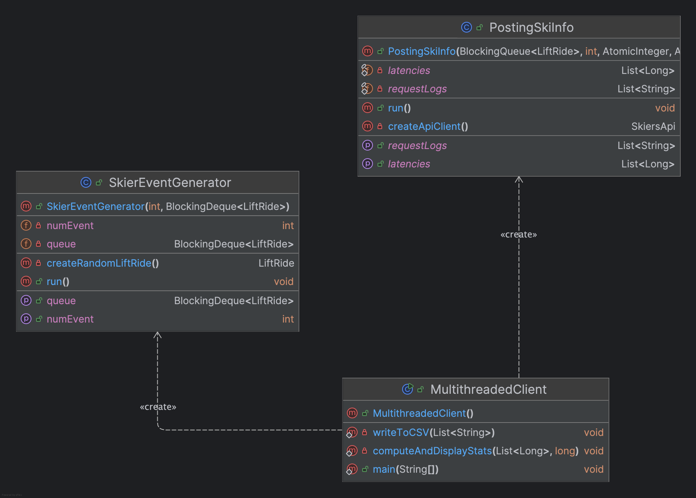

# Ski Resort Client Documentation

## Configuration

### Server Configurations

1. Deploy the `Assignment1.war` file to your EC2 instance running Tomcat.
2. Ensure that your EC2 instance is properly configured to allow traffic on port 8080.
3. Start the Tomcat server and verify that the application is running by accessing `http://{server-public-ip}:8080/Assignment1/`.
4. Make sure the API endpoints are accessible and functioning correctly.

### Client Configurations

1. Update API endpoint in `PostingSkiInfo.java`:
```java
private SkiersApi createApiClient() {
    ApiClient apiClient = new ApiClient();
    apiClient.setBasePath("http://{server-public-ip}:8080/Assignment1/");
    return new SkiersApi(apiClient);
}
```

2. Adjust thread (Optional) and request settings in `MultithreadedClient.java`:
```java
// example:
private static final int INITIAL_THREADS = 32;        // Phase 1 threads
private static final int PHASE2_THREADS = 100;        // Phase 2 threads
private static final int TOTAL_REQUESTS = 200000;    // Total requests to send
```

3. Simply run `MultithreadedClient.java`:
```bash
javac MultithreadedClient.java
java MultithreadedClient
```


## Design Documentation

### Client Design Overview
The client implements a multi-threaded architecture to efficiently send POST requests to a ski resort API. It uses a two-phase approach to handle 200,000 POST requests with optimal throughput.



### Key Components

1. **MultithreadedClient (Main)**
   - Manages overall execution flow
   - Handles statistics collection and reporting
   - Coordinates between event generation and request processing

2. **SkierEventGenerator (Producer)**
   - Generates random lift ride events
   - Populates shared blocking queue
   - Ensures thread-safe event distribution

3. **PostingSkiInfo (Consumer)**
   - Processes POST requests to API
   - Implements retry logic
   - Records latency metrics
   - Manages request success/failure tracking

### Thread Safety Considerations
1. Shared Resources:
   - BlockingQueue for event distribution
   - AtomicInteger for request counting
   - Synchronized lists for metrics collection

2. Synchronization Mechanisms:
   - CountDownLatch for phase coordination
   - ThreadPoolExecutor for thread management
   - Thread-safe collections for metrics

### Threading Strategy
- Phase 1: 32 threads × 1000 requests = 32,000 requests
- Phase 2: 100 threads × ~1680 requests = 168,000 requests
- Uses ThreadPoolExecutor for managed thread lifecycle
- Implements CountDownLatch for synchronization

### Error Handling
- Implements 5 retry attempts for failed requests
- Captures and logs all exceptions
- Records failed requests separately
- Maintains system stability during errors

### Performance Analysis

#### Little's Law Calculations
Little's Law states: L = λW
- L = Average number of requests in system
- λ = Average arrival rate (throughput)
- W = Average time spent in system

From our metrics:
- W (Average response time) = 98.61 ms
- λ (Measured throughput) = 291.57 requests/second
- L (Calculated) = 291.57 * 0.09861 ≈ 29 concurrent requests

Theoretical maximum throughput:
- Given 32 threads in Phase 1
- Average response time of 98.61 ms
- Maximum theoretical throughput = 32/0.09861 ≈ 324 requests/second

Our achieved throughput (291.57 req/sec) is about 90% of theoretical maximum, indicating efficient resource utilization.

### Current Performance Metrics
- Success Rate: 100% (200,000/200,000 requests)
- Mean Response Time: 98.61 ms
- Median Response Time: 96 ms
- 99th Percentile: 190 ms
- Throughput: 291.57 requests/second

### Client Outputs
**Client-1**


-
**Client-2**


### RESTful API Screenshots
To show clients actually send requests to the server on EC2 instance - using Postman testing page showing URL


`
