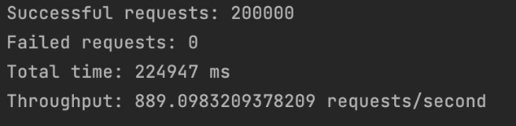

# Ski Resort Client Documentation

Zhiwei Zhou - CS6650 Assignment 2

**GitHub Repository**: [https://github.com/zz39/SkiResort-CS6650](https://github.com/zz39/SkiResort-CS6650)

## Configuration

### Server Setup Instructions

1. Deploy `Assignment2.war` to your Tomcat-enabled EC2 instance
2. Deploy `Consumer-1.0-SNAPSHOT.jar` to the same EC2 instance
3. Configure your EC2 security groups to allow traffic on:
   - Port 8080 (Tomcat)
   - Port 15672 (RabbitMQ management)
   - Port 5672 (RabbitMQ messaging)
4. Start the Tomcat server
5. Verify deployment by accessing `http://{server-public-ip}:8080/Assignment2/`
6. Test API endpoints to ensure proper functionality

## System Architecture

### Server Implementation (Servlet)

**Servlet Package**
- `HttpServlet`: Extended by the `SkierServlet` class to handle HTTP requests and responses (Java Servlet API)

**RabbitMQ Client Package**
- `ConnectionFactory`: Creates connections to the RabbitMQ server
- `Connection`: Represents an active connection to RabbitMQ
- `Channel`: Represents a communication channel within a connection
- `Queue`: Represents a message queue in RabbitMQ

#### Processing Flow

**Channel Pool Management**
- Static initialization block (`static { initializeChannelPool(); }`) creates a fixed pool of channels
- Channels are stored in the `channelPool` queue for efficient reuse

**HTTP Request Processing**
- The servlet overrides `doGet` and `doPost` methods
- URL path validation occurs in both methods
- Invalid URLs return a 404 (Not Found) status code

**Message Handling**
- In `doPost`, valid requests have their body read and packaged into JSON
- The skier ID is included in the message
- `sendToMessageQueue` method handles transmission to RabbitMQ:
  1. Polls a channel from the pool
  2. Publishes the message to the queue
  3. Returns the channel to the pool

### Consumer Implementation

#### Primary Classes

**LiftRideConsumer**
- Establishes RabbitMQ server connection
- Manages the channel pool
- Provides utilities for message data extraction

**ConsumerThread**
- Implements `Runnable` interface
- Each instance runs in a dedicated thread
- Responsible for consuming messages from the queue

#### Processing Flow

**System Initialization**
- `LiftRideConsumer` initializes the channel pool
- Launches `NUM_OF_THREAD` concurrent `ConsumerThread` instances
- Each thread consumes messages from the designated queue

**Message Processing**
- Each `ConsumerThread`:
  1. Polls a channel from the shared pool
  2. Consumes messages from the RabbitMQ queue
  3. Parses incoming messages to extract skier ID and LiftRide data
  4. Updates the `skierLiftRides` map with new lift ride information

**Concurrency Handling**
- Uses `ConcurrentHashMap` for thread-safe data updates
- Implements `BlockingQueue` for the channel pool to ensure thread-safe operations

#### Message Flow:

**Sending Messages:**
A client sends an HTTP POST request to the servlet with the skier data in the
request body. The servlet packages the data into a JSON message and
sends it to the RabbitMQ queue using one of the pooled channels.

**Receiving Messages:**
the LiftRideConsumer class consumes messages from the SkierQueue using
multiple ConsumerThread instances. Each thread extracts the skier ID and lift
ride information from the JSON message and updates the skierLiftRides map
with this data. The map is a ConcurrentHashMap to ensure thread-safe.

#### Result for single EC2 instance:
- Queue length: 0
- Throughput: 826 requests/second
- Number of producer channels: 120
- Number of consumer channels: 120

#### Result for ELB EC2 instance:

- Queue length: 0
- Throughput: 826 requests/second
- Number of producer channels: 120
- Number of consumer channels: 120
- Number of Load Balancers on EC2: 3

