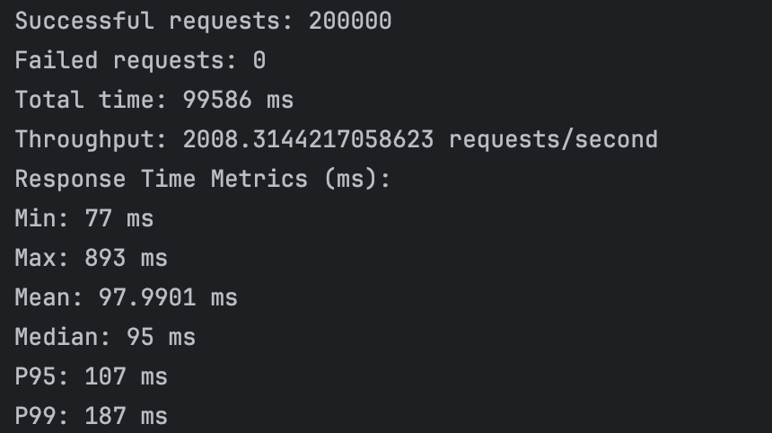
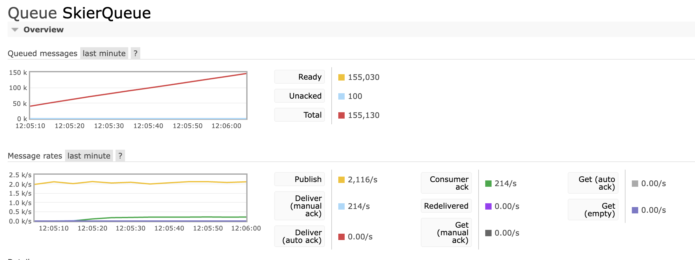
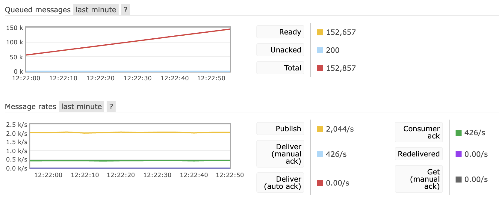
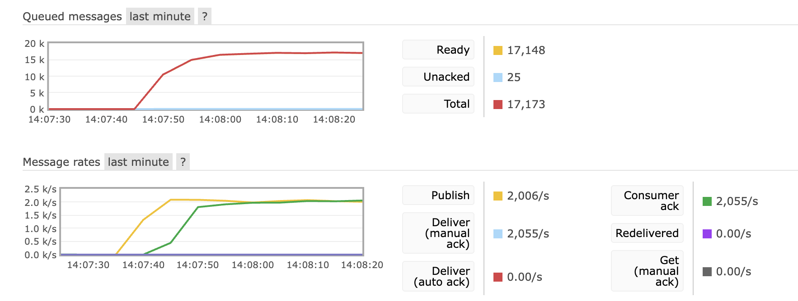
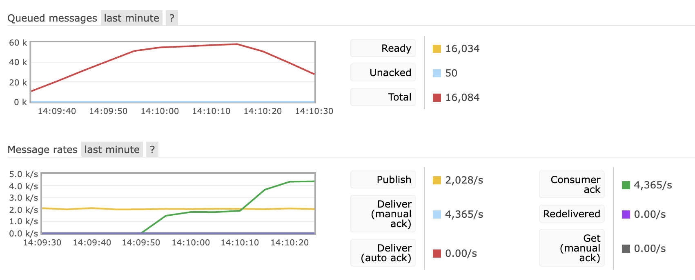

# CS6650 Assignment 3 Report
**Zhiwei Zhou**
**zhou.zhiwe@northeastern.edu**

GitHub Repo:  https://github.com/zz39/SkiResort-CS6650

## Database Design and AWS Deployment Topology

For CS6650 Assignment 3, I designed a high-performance, scalable database system using AWS services, including RabbitMQ for message queuing and DynamoDB for data storage. This deployment topology is as follows:

- **Message Queue (RabbitMQ)**: Hosted on an EC2 instance with the following specifications:
  - Instance Type: `t3.micro`
  - Network recovery and automatic reconnection enabled.
  - Configured with prefetch count for efficient batch processing.

- **Database (DynamoDB)**:
For this assignment, the system leverages Amazon DynamoDB as the primary database for storing skier activity data. It is fairly easy to implement due to its serverless operations. Each record contains the following attributes:
- **resortID**: Partition key (String)
- **seasonID**: Sort key (String)
- **dayID**: (String)
- **skierID**: (String)
- **body**: JSON object containing liftID and time data (String)
- On-demand capacity mode for scalability.
- Primary key: `(seasonID, skierID)`

## Optimized Consumer Design
The initial consumer implementation processed messages sequentially, resulting in a throughput of **200 messages per second**. This limited the system’s ability to handle high message volumes efficiently.

To optimize performance, I implemented asynchronous batch writes to DynamoDB using the `BatchWriteItem` API with a batch size of 25. Additionally, I tested multithreading with **100 threads per consumer** and deployed **multiple consumers** to enhance throughput.

### Performance Comparison
- **Before Optimization:** ~210 messages/second
- **After Optimization (1 Consumer):** ~2050 messages/second
- **After Optimization (2 Consumers):** ~4300 messages/second

This represents a **10x improvement in throughput** compared to the initial implementation, demonstrating the effectiveness of batching and concurrent processing.

## Client Test Run and RMQ Console Screenshots

- Screenshot 1: Client Request Throughput

- Screenshot 2: Single Consumer Throughput (Before Optimization)

- Screenshot 3: Two-Consumer Throughput (Before Optimization)

- Screenshot 4: Single Consumer Throughput (After Optimization)

- Screenshot 5: Two-Consumer Throughput (After Optimization)

## Conclusion
The optimized consumer design achieves significant performance gains, efficiently handling large message volumes. This setup can easily be scaled further by increasing consumer instances and DynamoDB capacity as needed.

The next step is to implement a load balancer to distribute incoming requests evenly across multiple consumer instances, further enhancing system performance and reliability. I had some connection issues with the load balancer and EC2s, so I will work on that next.

